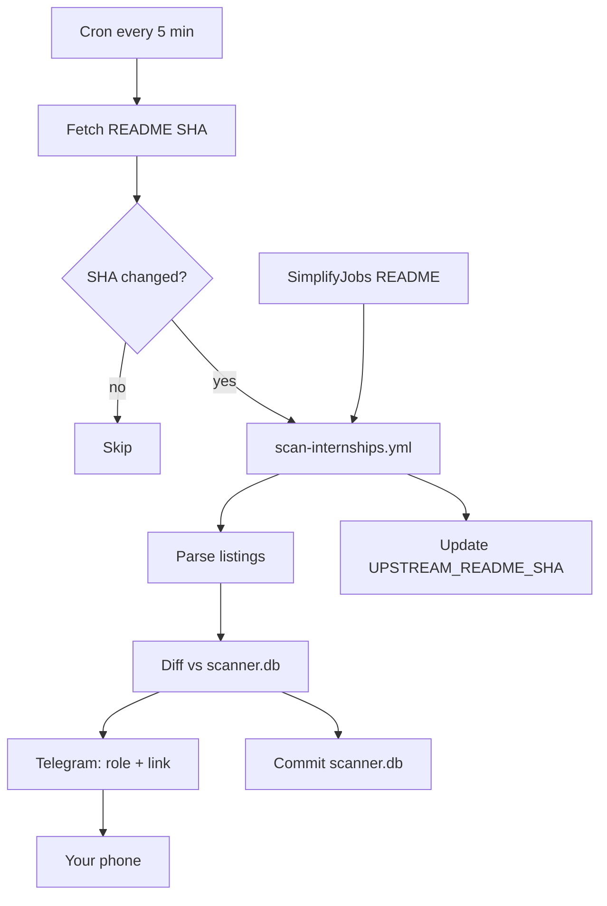
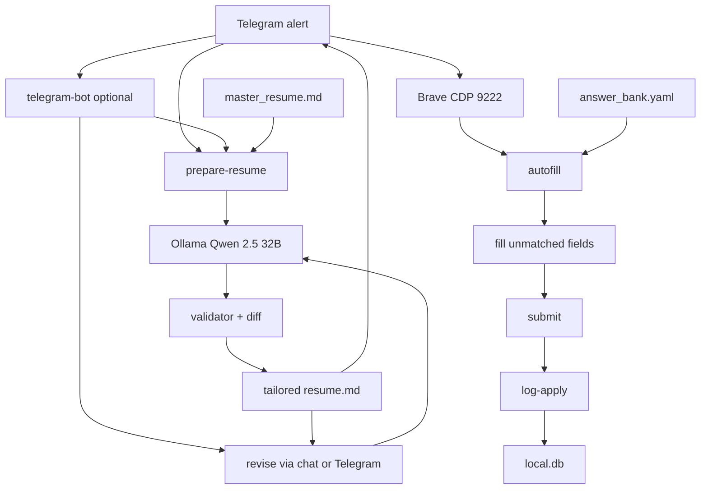

# job-apply-assistant

Monitors [SimplifyJobs off-season internships](https://github.com/SimplifyJobs/Summer2026-Internships/blob/dev/README-Off-Season.md), sends Telegram alerts when new jobs appear, and helps you apply from your Mac with a locally tailored resume and answer-bank autofill.

Two halves: **CI watches 24/7** (alert only), **your Mac does the work** (resume + apply).

## Architecture

| Phase | Where | What |
|-------|-------|------|
| **1 — Scanner** | GitHub Actions (every 5 min) | Detect new/reopened jobs → **Telegram alert only** |
| **1b — Resume** | Your Mac (Ollama) | Tailor/revise resume when you sit down — not in CI |
| **2 — Apply** | Your Mac | Brave CDP autofill from answer bank → you review & submit |

CI never touches your resume or calls an LLM. Resume work uses **local Ollama** (`qwen2.5:32b-instruct-q4_K_M` on M4 Pro 24GB).

### Phase 1 — Scanner (GitHub Actions, every 5 min)

```
SimplifyJobs README-Off-Season.md
            │
            ▼
   ┌────────────────────────────┐
   │  GitHub Actions (24/7)     │
   │                            │
   │  Cron (every 5 min)        │
   │       │                    │
   │       ▼                    │
   │  Fetch README SHA (~10s)   │
   │       │                    │
   │       ▼                    │
   │  SHA changed? ──no──► skip  │
   │       │ yes                │
   │       ▼                    │
   │  scan-internships.yml      │
   │  parse → diff vs scanner.db│
   │       │                    │
   │       ├──► Telegram alert  │──► your phone
   │       ├──► commit scanner.db
   │       └──► update UPSTREAM_README_SHA
   └────────────────────────────┘
```

<details>
<summary>Mermaid version (renders on GitHub)</summary>



</details>

**CI secrets:** `TELEGRAM_BOT_TOKEN` and `TELEGRAM_CHAT_ID` only — no resume, no LLM, no API keys.

### Phase 1b + 2 — Laptop (when you sit down)

```
Telegram alert (job ID + apply link)
            │
            ▼
   ┌────────────────────────────┐
   │  Your Mac                  │
   │                            │
   │  prepare-resume /prepare   │
   │       │                    │
   │       ▼                    │
   │  Ollama (Qwen 2.5 32B)     │◄── master_resume.md + facts.json
   │       │                    │
   │       ▼                    │
   │  validator + diff          │
   │       │                    │
   │       ▼                    │
   │  tailored resume.md        │──► Telegram (review)
   │       │                    │
   │       ▼                    │
   │  revise-chat / Telegram    │──► local.db (history)
   │       │                    │
   │       ▼                    │
   │  Brave + CDP port 9222     │
   │       │                    │
   │       ▼                    │
   │  autofill (answer bank)    │◄── profile.json + answer_bank.yaml
   │       │                    │
   │       ▼                    │
   │  you fill gaps + submit    │
   │       │                    │
   │       ▼                    │
   │  log-apply                 │
   └────────────────────────────┘
```

<details>
<summary>Mermaid version (renders on GitHub)</summary>



</details>

### What lives where

| Data | Location | In git? |
|------|----------|---------|
| Job listings + notify state | `scanner.db` | Yes (CI commits) |
| Master resume, profile, answers | `job_assistant/data/` | No (local only) |
| Tailored resumes | `resumes/*.md` | No |
| Revise history + apply log | `local.db` | No |

### Design principles

- **Human in the loop** — never auto-submits
- **CI is cheap** — SHA poll (~10s) + full scan only on change
- **Resume is local** — Ollama on your Mac, $0 per application
- **Forms are deterministic** — answer bank matching, not an LLM agent

## Quick start (local)

```bash
cd ~/Desktop/anushprojects/job-apply-assistant
python3 -m venv .venv && source .venv/bin/activate
pip install -r requirements.txt
playwright install chromium

# Ollama (one-time)
ollama pull qwen2.5:32b-instruct-q4_K_M

cp .env.example .env
python -m job_assistant setup
python -m job_assistant import-resume
# Edit job_assistant/data/profile.json
```

## GitHub setup (public repo)

1. Push to `git@github.com:AnushSonone/job-apply-assistant.git`
2. Add **Secrets** (Settings → Secrets → Actions):
   - `TELEGRAM_BOT_TOKEN`
   - `TELEGRAM_CHAT_ID`
3. Add **Variable**: `UPSTREAM_README_SHA` (leave empty; CI sets it)
4. Commit `job_assistant/data/scanner.db` (`python -m job_assistant init-db`)

## Commands

```bash
python -m job_assistant init-db
python -m job_assistant import-resume
python -m job_assistant scan                    # alert-only (same as CI)
python -m job_assistant list --active
python -m job_assistant prepare-resume --job-id ID   # laptop: initial tailor
python -m job_assistant revise-chat --job-id ID
python -m job_assistant telegram-bot            # /prepare and /revise from phone
python -m job_assistant autofill --job-id ID --advance
python -m job_assistant add-answer "how did you hear" "LinkedIn"
python -m job_assistant log-apply ID
```

## Typical session

1. **Phone** — Telegram alert: role + apply link (Canada locations skipped)
2. **Laptop** — `prepare-resume --job-id ID` (Ollama tailors, ~1–3 min)
3. **Phone/laptop** — Review; revise via Telegram replies or `revise-chat`
4. **Brave** — Open apply link with CDP enabled
5. **Laptop** — `autofill --job-id ID --advance`
6. **You** — Fill gaps, submit
7. **Laptop** — `log-apply ID`

```bash
open -a "Brave Browser" --args --remote-debugging-port=9222
```

## Resume revision (local Ollama)

Facts validator + diff summary guard against invented content. Multi-turn history in `local.db`.

**Option A — Telegram** (laptop running bot + Ollama):

```bash
python -m job_assistant telegram-bot
# /prepare abc123
# Reply to resume file: "Shorten the Visa bullet"
```

**Option B — CLI:**

```bash
python -m job_assistant prepare-resume --job-id abc123 --telegram
python -m job_assistant revise-resume --job-id abc123 "Don't say agentic" --telegram
python -m job_assistant revise-chat --job-id abc123
```
